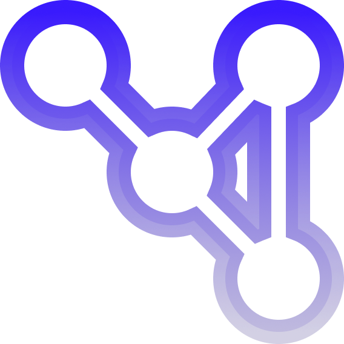

#  <br> Next Page Protocol
The **Next Page** (NP) Protocol  enables web pages to have a richer and more dynamic navigation experience, allowing them to communicate relevant information based on the page's context.

Similar to Open Graph, which allows a webpage to behave like an object with static information, **Next Page** adds the ability for web pages to share information relative to each other.

Using a client application that implements NP, such as `mously.js` for the web, enables webpages to use NP Features.

## Card
Cards are the final result of a request to a NP defined webpage. It represents the different sections returned by the request

#### Sections:
> 📍 **NOTE:** <br>How card sections are displayed is determined by the client you use.

* `Title` - Describes the title for the response
* `Description` - Describes the description for the response
* `icon` - Describes the icon for the response
* `Action` - Describes the action button and its link
* `View` - Describes the view for the response and its results


## Base Meta Properties
Base properties allow you to set values globally for a page. They also act as fallbacks to [nodes](#nodes) that don't define their own base properties *(Talk about nodes in a later section)*.

To make a webpage Next Page compatible, at a minimum, you will need to define some basic base properties using meta tags.

- `np-title` - Title for the view.
- `np-description` - Description for the view

## Defining base properties
Base properties are defined in the head of the page using meta tags. To define the basic `np-title` & `np-description`:

```html
<head>
    ...
    <meta name="np-title" content="Global Title For View">
    <meta name="np-description" content="Global Description For View">
    ...
</head>
```

## List Of Base Properties
| Base Property   |      type      |
|-----------------|:--------------:|
| np-title        |     String     |
| np-description  |     String     |
| np-action       |  Label > URL   |
| np-icon         |     URL        |

## Description Of Base Properties
- `np-title` - Defines the title for the card
- `np-description` - defines the description for the card
- `np-action` - Defines an action button for the card and a link 
- `np-icon` - Defines the icon for the card

### Icon Fallback
If a `np-icon` property is not defined in the head np will fallback to the `"<link rel="icon" ... >"`.

## Views
Next Page uses views as the way of displaying information to a client.

> 📍 **NOTE:** <br>
How views are implemented depends on the client you use.

### View Types
Views are elements that display information to a client in a certain layout.

- `basic` - Contains a title, description, and icon.
- `article` - Contains a `basic view` + 1 to 3 paragraphs.
- `image` - Contains a `basic view` + 1 image.
- `image.grid` - Contains a `basic view` + 2 to 6 images.
- `video` - Contains a `basic view` + 1 video.

An element in the body that declares an NP attribute is called a [node](#nodes). An element that declares an np attribute without the `np-for` attribute is an invalid node and will need the `np-for` attribute to make it valid. We'll cover this in the [next section](#nodes).

### View Queries
View queries are the way views look for their data in a node.

By default, views will look at the children of their element to find their data.

#### Default view queries
- article - will query for `"Element > p"` and retrieve the first 300 characters.

- image - will query for `"Element > img"` and retrieve the first instance.

- image.grid - will query for `"Element > img"` and retrieve the first 6 instances. if only one image is found, the `image.grid view` will invoke the `image view`.

- video - will query for `"Element > video"` and retrieve the first instance.

- basic - Will look for `Information Properties` to find its data; if no property is defined in the node, the head properties are used.


#### Defined view queries
If you define [informational properties](#informational-properties) inside the node but outside its children nodes.

- article - will query for `"Element [np-p]"` and retrieve the first 300 characters.

- image - will query for `"Element [np-img]"` and retrieve the first instance.

- image.grid - will query for `"Element [np-img]"` and retrieve the first 6 instances. if only one image is found, the `image.grid view` will invoke the `image view`.

- video - will query for `"Element [np-video]"` and retrieve the first instance.

- basic - Will look for [Information Properties](#informational-properties) to find its data; if no property is defined in the node, the head properties are used.


#### Custom view queries
Custom queries enable you to exert greater control over the retrieval of view data using `CSS queries`.

**Local Queries** <br>
Local queries enable you to select data within the declared node by using the `>` (local operator) followed by your query after the view type in the `np-view` property as follows:

```html
<div np-view="{view type} > {query}"></div>
```
**Example Defining a local query:**
```html
<article 
    np-for="fender"
    np-view="image.gird > a > img">

    <h1>John Mayer W/ Fender</h1>
    <p>Lorem ipsum dolor sit, amet consectetur adipisicing elit. Dolorem et rem hic.</p>

    <a href="./gallery/johnmayer" class="img">
        
    </a>
     <a href="./gallery/johnmayer" class="img">
        
    </a>
     <a href="./gallery/johnmayer" class="img">
        
    </a>
</article>
```

This will define an `image.grid` view and query its node with `"a > img"`

**Global Queries** <br>
Global queries enable you to select data outside the declared node by using the `>>`(global operator), followed by your query after the view type as follows:

```html
<div np-view="{view type} >> {query}"></div>
```
**Example Defining a global query:**

```html
<article 
    np-for="fender"
    np-view="image.gird >> .aside > .fender-gallery > img">
    ...
</article>
```

This will search `.aside > .fender-gallery > img"` against the whole document.


### Retrieving Tags for Views

When declaring a custom view query, each view type searches for the first `n` instances of its valid element.

| View               | Tags                           | 
|------------------|:---------------------------------|
| `basic`      | Utilizes only informational properties  | 
| `article`    | First instance of any element with inner text or `np-p` property |
| `image`      | First instance of an `img` tag  or `np-img` property|
| `image.grid` | First 6 instances of `img` tags or `np-img` property |
| `video` | First instances of `video` tag or `np-video` property |


### Query Priority
1. Custom view query
2. Defined view query
3. Default view query


## Nodes
Nodes are elements defined by the `np-for` attribute and act as a type of `key` or `id` to a client request.

#### About the np-for attribute
>Values for the `np-for` lookup are case-insensitive.

>`np-for` values can only contain `1 key`, and spaces are not allowed.

### Defining a few Nodes
Let's imagine we are on a page of an artist encyclopedia-type website that contains information about John Mayer (let's call it `Page:A`).

On the page, there is a section on the different guitar brands he has used and some information relative to that brand and John Mayer.

We define the nodes using `np-for` and its `view`.

```html
<main>
    <h1>Guitar brands used by John Mayer</h1>

    <article 
    np-for="fender"
    np-view="image.grid">
        
        
        
    </article>

    <article 
    np-for="Gibson"
    np-view="basic">

    ...
    </article>

    <article 
    np-for="PSG"
    np-view="article">

    ...
    </article>
</main>
```

#### Client Requests
Now let's imagine we are on the page of another website that sells Fender guitars (let's call it `Page:B`), and it references the `fender` key on `Page:A`. 

Without the user needing to click on a different website to get information, a `grid view` will display on the current page with an image grid of guitars used by John Mayer.

Here is the list of tags that will be retrieved client-side:
Information from the head.

```html
<meta name="np-description" ...>
<meta name="np-title" ...>
<link rel="icon" ... >
```

Information from the node

```html
<article np-view="image.grid" .../>
3[img]
```

### Declaring Base Properties
Base properties can be defined in nodes to customize the card for its perticular response.

For the following example we will define base property values in the attribute and will be covered more in-depth in the [Informational Properties](#informational-properties) Section.

```html
<article 
    np-for="fender"
    np-view="image.grid">
        <h1 np-title="John Mayer's Fenders"> List of Fender Images</h1>
        <h1 np-icon="John Mayer's Fenders"> List of Fender Images</h1>

        
        
        

        <a np-action="Buy Now > http://www.fender.com/buy/item?009343">Buy a Fender guitar</a>
</article>
```


## Informational Properties
Informational properties allow you to have more control over the response data of views.

Maybe you want summarized data to display instead of the default paragraph in the node, or you want a specific image to show up in the response; you can do that with informational properties.

### Informational Properties
- `np-p` - define a paragraph for the node <br>
When all declarations for the nodes are added, it may be a maximum length of 300 characters.

- `np-img` - define an image for the node <br>
String URL

- `np-action` - define a link for the node <br>
String URL

- `np-icon` - define an icon for the node <br>
String URL

- `np-description` - define a description for the node<br>
Up to 100 characters.
- `np-title` - define a title for the node <br>
Up to 35 characters

- `np-video` - define a video for the node <br>


| Properties        |      Format   | 
|-------------------|:--------------|
| `np-p`            | String        | 
| `np-img`          | URL           |
| `np-action`       | Label > URL   |
| `np-icon`         | URL           |
| `np-description`  | String        |
| `np-title`        | String        |
| `np-video`        | URL           |


> ❕ **Note:**<br>
Nodes only invoke informational properties where the property's immediate parent node is itself.

### Defining Informational Properties

Example of defining images with the informational Property `np-img`
```html
<article 
    np-for="fender"
    np-view="image">

    <h1>John Mayer W/ Fender</h1>
    <p>Lorem ipsum dolor sit, amet consectetur adipisicing elit. Dolorem et rem hic.</p>

    <a href="./gallery/johnmayer" class="img">

        
    </a>
</article>
```

Adding a custom title & description to the node
```html
<article 
    np-for="fender"
    np-view="image"
    np-title="John Mayer with a Stratocaster"
    np-description="John Mayer playing Stratocaster at the Manhattan stadium.">

    <h1>John Mayer W/ Fender</h1>
    <p>Lorem ipsum dolor sit, amet consectetur adipisicing elit. Dolorem et rem hic.</p>

    <a href="./gallery/johnmayer" class="img">

        
    </a>
</article>
```

### Properties as tags
You can add informational properties to elements without defining their value, and the element's value will be used.

For Example with `np-title`, `np-description`, and `np-img`

```html
<article 
    np-for="fender"
    np-view="image">

    <h1 np-title>John Mayer W/ Fender</h1>
    <p np-description>Lorem ipsum dolor sit, amet consectetur adipisicing elit. Dolorem et rem hic.</p>


    <a href="./gallery/johnmayer" class="img">
        
    </a>
</article>
```

### Property Priority

1. Properties defined `on` the root node (in the same element where the node is declared) will have the highest priority.

2. Properties defined `in` the root but outside any other node.


## Implementation
We provide parsers in different languages and hope you build cool tools with them! 

- `NPP w/ Javascript`
- `NPP w/ PHP` <sub>(NA)</sub>
- `NPP Java` <sub>(NA)</sub>
- `NPP C++` <sub>(NA)</sub>

### Recommended NPP web Client
- `Mously.js` <sub>(NA)</sub>
